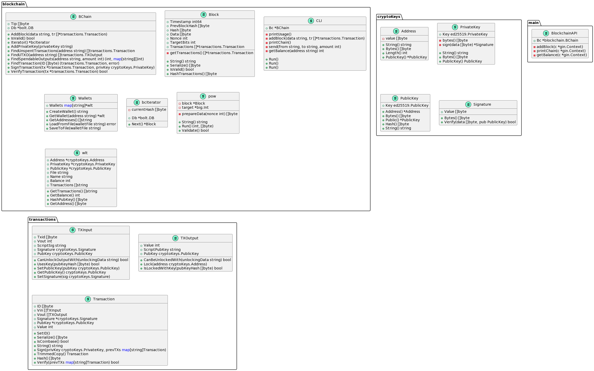

# BlockC

BlockC is a simple blockchain implementation in Go.

## Structure

The project is structured as follows:

- `blockchain`: Contains the core blockchain implementation, including the blockchain itself (`bc.go`), blocks (`block.go`), and a command-line interface (`CLI.go`).
- `cryptoKeys`: Contains the implementation for cryptographic keys and signatures.
- `transactions`: Contains the implementation for transaction inputs (`input.go`), outputs (`output.go`), and transactions themselves (`trans.go`).
- `wallet`: Contains the wallet implementation.
- `Tests`: Contains unit tests for the blockchain.
- `main.go`: The entry point of the application.

## Usage

To run the application, use the following command:

```bash
go run main.go
```

## Endpoints
The application provides the following HTTP endpoints:

POST /addblock: Adds a new block to the blockchain. The block data should be provided as a form value.
GET /printchain: Returns the entire blockchain.
GET /getbalance/:address: Returns the balance of the given address.

## internal structure
